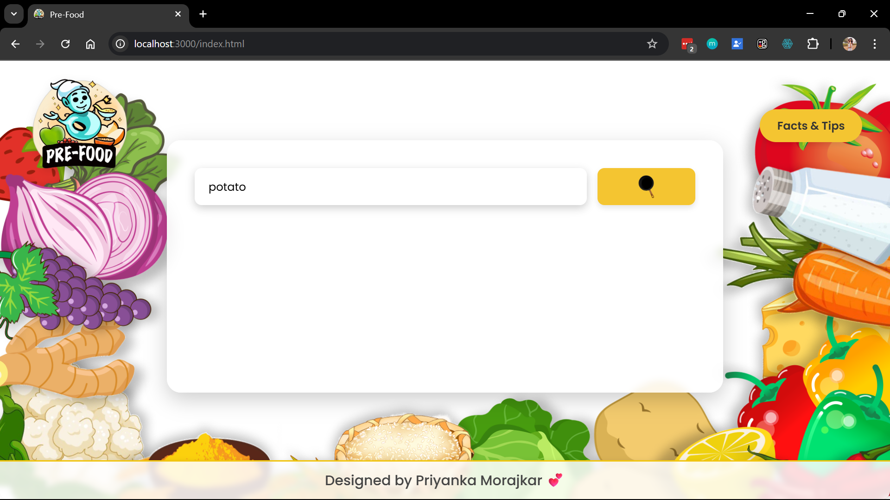
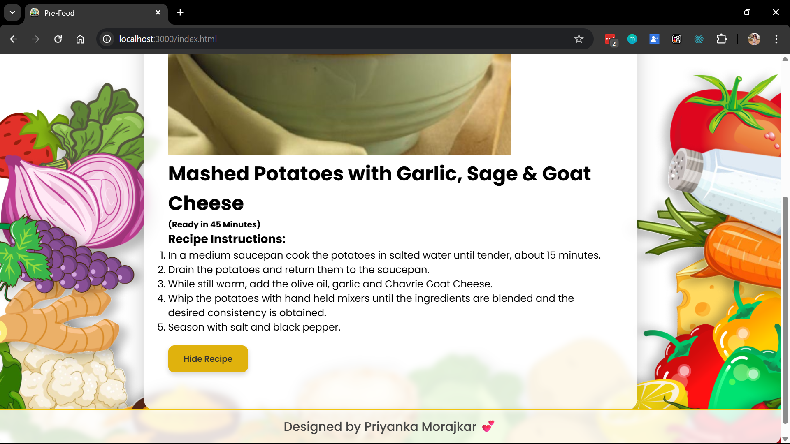
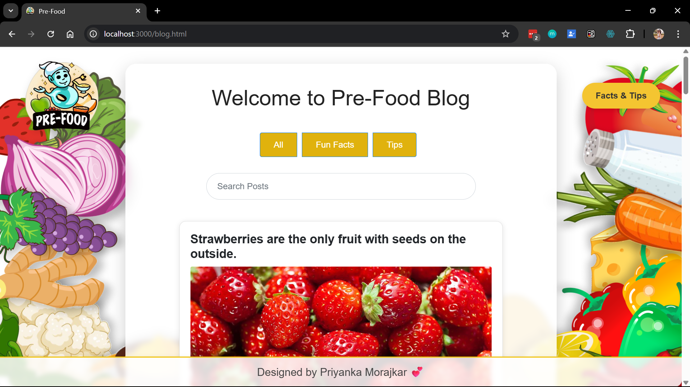
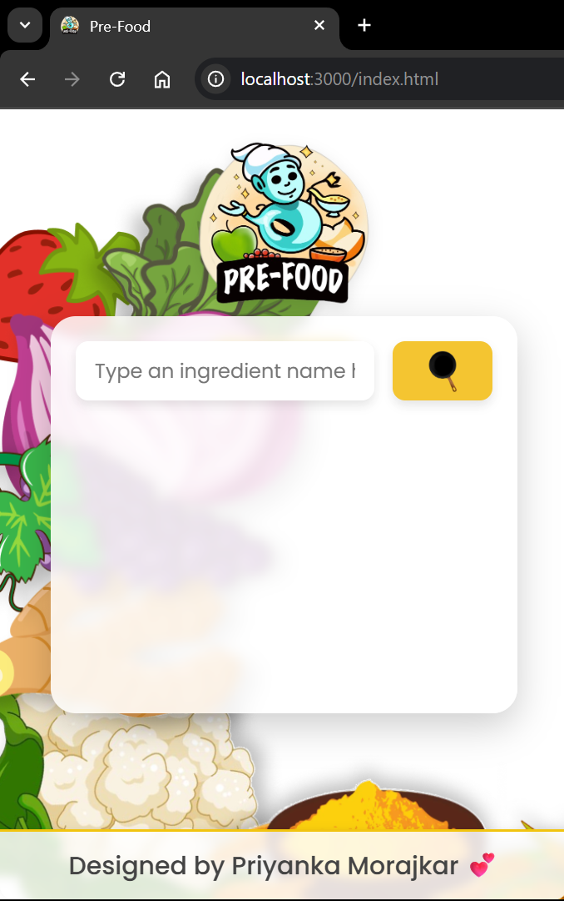

# Pre-Food

Pre-Food is a responsive recipe web app that fetches recipes from the Spoonacular API and displays detailed cooking instructions, ingredients, and images in a user-friendly format.

---

## Features

- Search recipes by ingredient  
- Show recipe title, preparation time, ingredients, and images  
- View detailed step-by-step recipe instructions  
- "Facts & Tips" section with filters (All, Facts, Tips)  
- Responsive UI built with Bootstrap 5  

---

## Technologies

- HTML, CSS, JavaScript  
- Bootstrap 5  
- Spoonacular API  

---

## Installation

1. **Clone the repository:**  
   ```bash
   git clone <repo-url>
   cd pre-food
   ```

2. **Obtain a Spoonacular API key **
 https://spoonacular.com/food-api.

3. **Add your API key securely**
To your environment or backend configuration.

4. **Open index.html**
In your browser to start exploring recipes.

---

## Example

<table>
  <tr>
    <td></td>
    <td></td>
  </tr>
  <tr>
    <td></td>
    <td></td>
  </tr>
</table>


## Notes

- Make sure your API key usage complies with Spoonacular’s terms.

- Designed for desktop and mobile with Bootstrap’s responsive grid.

- Easily extendable to include more recipe filters or user features.

--- 

## License

This project is licensed under the MIT License.

---

## Author: Priyanka Morajkar